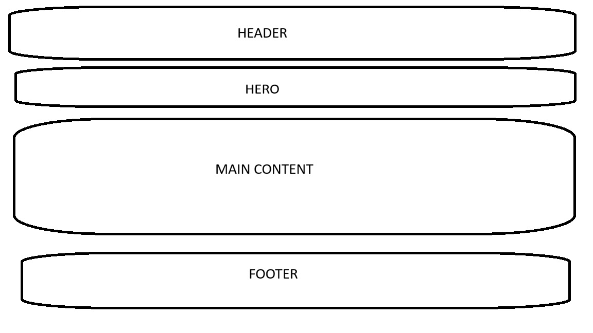

# Design Overview for Amazon Website Clone

## Goal

The goal of this project is to replicate the main page of Amazon's website using
HTML, CSS, and possibly JavaScript.

## User Interface Design

### Layout

The layout will mimic Amazon's main page with a header, navigation bar, search
functionality, product listings, and footer.

### Colors and Styling

Colors will follow Amazon's branding with a focus on usability and
accessibility. Fonts and icons will be chosen to match the original design as
closely as possible.

### Responsiveness

The design will be responsive, ensuring compatibility across various devices and
screen sizes.

## Tools and Technologies

- HTML5 for structure
- CSS3 for styling
- Possibly JavaScript for interactivity

## Mockup

